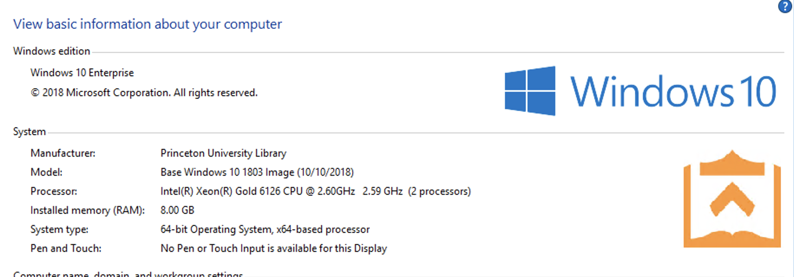
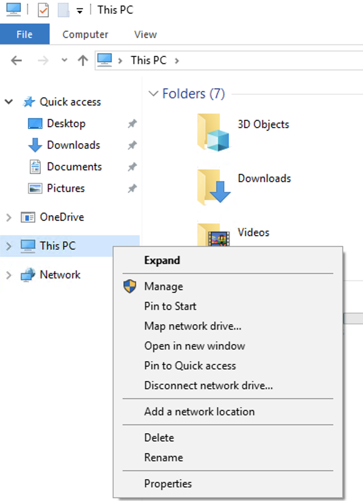
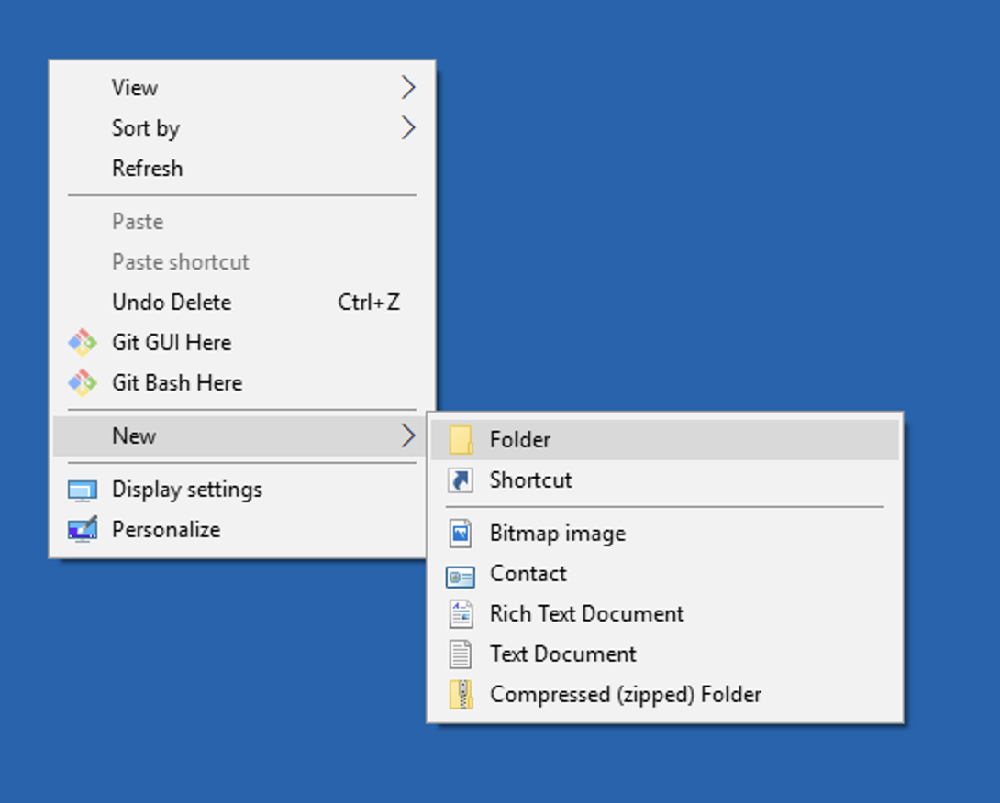
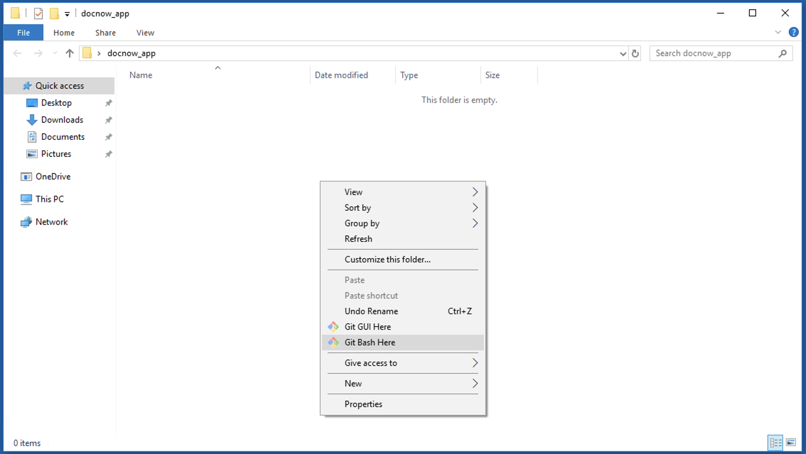

## On Microsoft Windows

If you intend to run Docnow on Microsoft Windows

### Prerequisites

* At least 8GB memory
   * select system properties to get this
* [Git for Windows](https://gitforwindows.org/)
* Install [Docker](https://hub.docker.com/editions/community/docker-ce-desktop-windows) which will automatically install Docker Compose
* (optional) reverse proxy web server ideally with TLS. Your reverse proxy server will listen on port 3000 for the docnow application


### Installing Docnow

Before you do anything make sure your Docker Application is running.

* Create a new directory on your Desktop by Right Clicking and naming it `docnow_app` 
* Right click in the new directory to say Git Bash here 
* From the Git Bash Terminal Client install Docnow from the repository, clone the repository locally:

```bash
git clone https://github.com/docnow/docnow.git
cd docnow
docker-compose up -d
```

Launch your preferred browser and open up: [http://localhost:3000](http://localhost:3000)
